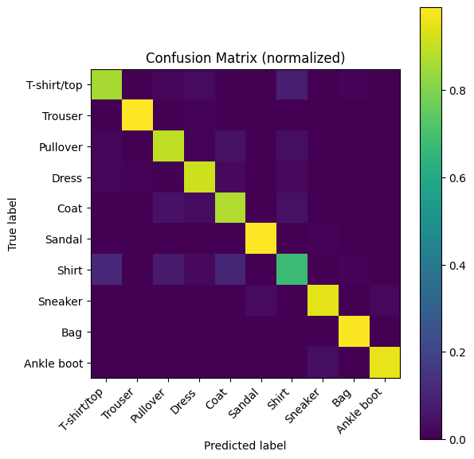

# 👕 Fashion MNIST Image Classification — Turing Test '25 (Wildcard Round)

**Author:** Anushka Chandel  
**Branch:** CSE-1  
**Roll No.:** 2400270100042  

This repository contains my submission for **The Turing Test’25 — Wildcard Round (ML Track)**.

---

## 🔧 Tech Stack
- Python 3.10+
- TensorFlow / Keras
- NumPy, Matplotlib, scikit-learn

---

## 📂 Repository Structure
```
.
├── fashion_mnist.ipynb        # Colab-ready notebook
├── train.py                   # Training script
├── requirements.txt           # Dependencies
├── README.md                  # Project overview
├── REPORT.md                  # Detailed write-up
├── fashion_model.keras        # Saved trained model
├── classification_report.txt  # Model evaluation report
└── confusion_matrix.png       # Visualization
```

---

## ▶️ Quickstart (Colab — Recommended)
1. Open **Google Colab**.
2. Upload `fashion_mnist.ipynb` to Colab.
3. Click **Runtime → Run all** (or run cells step-by-step).
4. The notebook will:
   - Load Fashion MNIST from Keras (no manual download needed)
   - Build & train a CNN with data augmentation
   - Evaluate on the test set (accuracy + confusion matrix + report)
   - Save the trained model as `fashion_model.keras`
5. Download the saved model (`fashion_model.keras`) from the Colab file browser.

---

## ▶️ Quickstart (Local)
```bash
python -m venv .venv
source .venv/bin/activate  # Windows: .venv\Scripts\activate
pip install -r requirements.txt
python train.py --epochs 12 --batch_size 128 --out fashion_model.keras
```
This will create:
- `fashion_model.keras` — the trained model
- `training_history.json` — accuracy & loss history
- `confusion_matrix.png` — normalized confusion matrix

---

## 🧠 Model (High-level)
- Input: 28×28 grayscale images (normalized to [0, 1])
- Architecture: Conv → Conv → MaxPool → Dropout → Conv → Conv → MaxPool → Dropout → Dense
- Regularization: Data Augmentation + Dropout
- Optimizer: Adam
- Loss: Sparse Categorical Crossentropy
- EarlyStopping & ModelCheckpoint callbacks

---

## 📊 Results
- **Validation Accuracy:** 0.9158
- **Test Accuracy:** 0.9077
- **Test Loss:** 0.2607

📌 Confusion Matrix:  


---

## 🔁 Reproducibility
Set random seeds inside the notebook/script for consistent runs. Use the same `epochs`, `batch_size`, and architecture to match results.

---

## ✨ Originality
- Used **data augmentation** for better generalization  
- Applied **EarlyStopping + ModelCheckpoint**  
- Included **confusion matrix and classification report** for clarity  

---

## 📌 Future Improvements
- Explore deeper CNNs or transfer learning (e.g., MobileNetV2)  
- Hyperparameter tuning (learning rate, batch size, etc.)  
- Use cross-validation for robustness  

---

## ✅ Submission Notes
- Repo contains source code, trained model, and documentation  
- All results are reproducible via notebook or script  
- Submission prepared for **ML-COE Wildcard Round 2025**  

---
